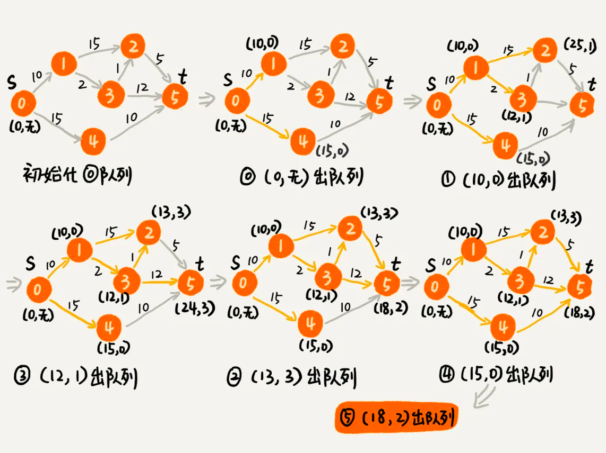

#### Dijkstra 算法

其实是动态规划的思路：
1. 从起始点开始访问起始点可达节点，记下起始点到该节点的距离(1(10), 4(15))
2. 选择最短的那个节点(1(10))作为顶点，访问这个顶点可达的节点，记下起始点到这些节点的距离
(1可达2，3， 2(10+15), 3(10+2))
3. 从这些还未访问过的节点中(还未访问过或者说是还未当做顶点的节点，其中0和1已经访问过了，剩余未访问的是
   4(15)，2(25), 3(12)）   中选择距离最小的作为顶点，继续2-3步骤，直到剩余未访问的节点中有目的节点且距离为剩余节点中最短即结束。
4. 如果出现已经访问过的点，则比较之前的距离和当前计算的距离，如果当前计算的距离比之前的距离小，更新该距离

比如当从4(15)，2(25), 3(12)）选择3(12)作为顶点继续访问，3可达2,5 由3到达2距离为12+1=13，13比2(25)小
则更新2(13)

如图，执行到底4张图形时，3可达2和5(目的节点)，但是剩余节点是4(15) 2(13) 5(24), 5(24)不是最短的，所以需要选择2(13)继续
2可达只有5，且5(13+5=18) 比5(24)短更新5(18),则还剩5(18) 4(15), 5(18)仍然不是最短的，则4(15)继续，4可达只有5，
且为5(15+10=25)), 比剩余的5(18)短，则最终最短路径为5(18).
