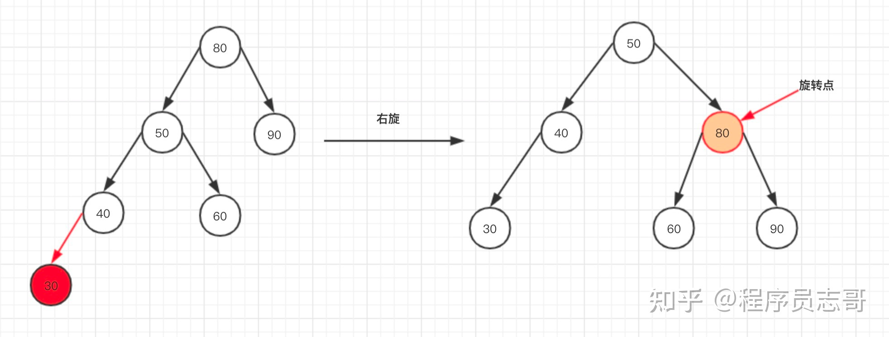
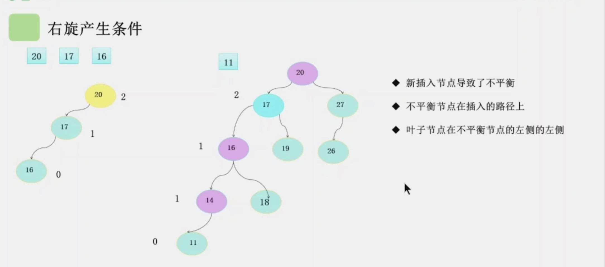
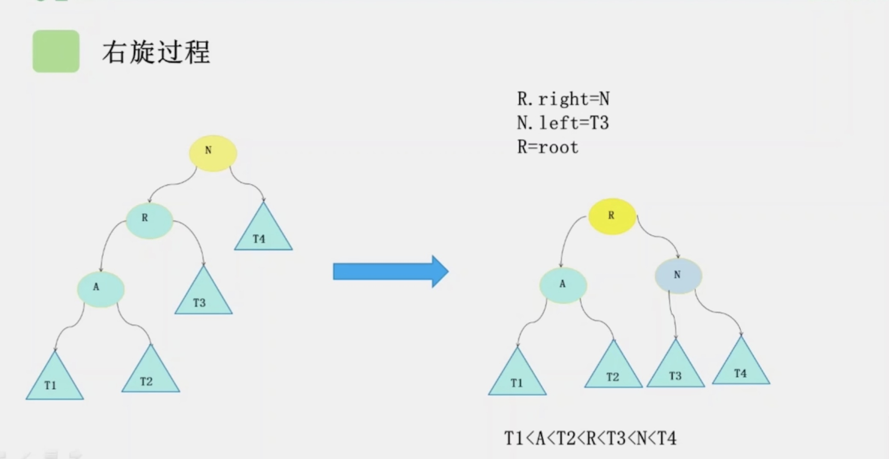
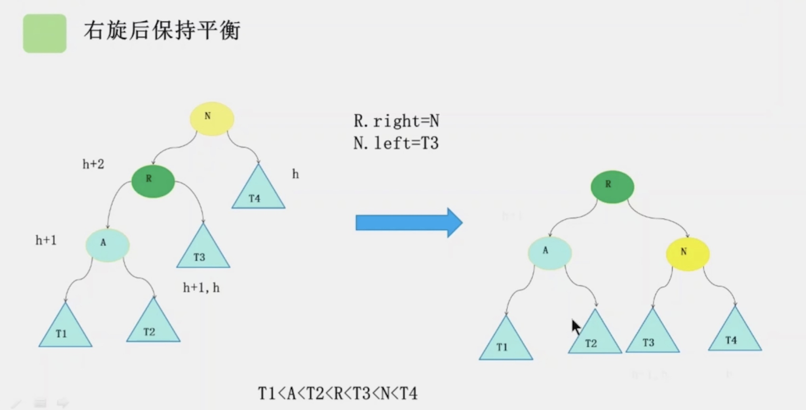

### Tree
我们把没有父节点的节点叫做根节点（Root）。我们把没有子节点的节点叫做叶子节点或者叶节点.  
还有三个比较相似的概念：高度（Height）、深度（Depth）、层（Level）。它们的定义是这样的(见tree_1.png):
- 节点的高度：节点到到叶子节点的`最长路径`(边树)
- 节点的深度：根节点到这个节点所经历的`边的个数`(深度的起始值不同的教材不同，有从0开始的也有从1开始的，比如清华大学出版的教材就是从1开始的)
- 节点的层数：节点的深度+1
- 树的高度：根节点的高度

#### 二叉树
- 每个节点最多只能有两个子节点的一种形式的树成为二叉树
- 二叉树的子节点分为左节点和右节点

##### 满二叉树
在一棵二叉树中，如果所有分支结点都存在左子树和右子树，并且所有叶子结点都在同 一层上，这样的一棵二叉树称作满二叉树。  

##### 完全二叉树
一棵深度为 k 的有 n 个结点的二叉树，对树中的结点按从上至下、从左到右的顺序进行 编号，如果编号为 i(1≤i≤n)的结点与满二叉树中编号为 i 的结点在二叉树中的位置相同，则 这棵二叉树称为完全二叉树。完全二叉树的特点是:叶子结点只能出现在最下层和次下层， 且最下层的叶子结点集中在树的左部。显然，一棵满二叉树必定是一棵完全二叉树，而完全 二叉树未必是满二叉树。
中序遍历非递归：LeetCode0094(代码中写了相同思路的中序遍历和后续遍历)
前序遍历非递归：LeetCode0144
后续遍历非递归：LeetCode0145

LeetCode0100  
LeetCode0101  
LeetCode0111  
LeetCode0112  
LeetCode0235

根据前序遍历和中序遍历构造树：LeetCode0105
根据中序遍历和后续遍历构造树：LeetCode0106

##### 二叉查找树（Binary Search Tree）
二叉查找树要求，在树中的任意一个节点，其左子树中的每个节点的值，都要小于这个节点的值，而右子树节点的值都大于这个节点的值。 
具体操作见BinarySearchTree.java, 特别注意理解BST的删除及找前驱和后继节点操作。  
BST时间复杂度  
不管操作是插入、删除还是查找，**时间复杂度其实都跟树的高度成正比，也就是 O(height)**。  
显然，极度不平衡的二叉查找树，它的查找性能肯定不能满足我们的需求。我们需要构建一种不管怎么删除、插入数据，在任何时候，都能保持任意节点左右子树都比较平衡的二叉查找树，一种特殊的二叉查找树，平衡二叉查找树。平衡二叉查找树的高度接近 logn，所以插入、删除、查找操作的时间复杂度也比较稳定，是 O(logn)。  

#### 平衡二叉查找树(Self-balancing binary search tree)
平衡二叉树的严格定义是这样的：二叉树中任意一个节点的左右子树的高度相差不能大于 1。从这个定义来看，上面讲的完全二叉树、满二叉树其实都是平衡二叉树，但是非完全二叉树也有可能是平衡二叉树。
(其它版本描述：任意一个节点在，平衡因子的绝对值不超过1， 平衡因子: 每个节点左子树和右子树的高度差叫做平衡因子)

平衡二叉查找树不仅满足上面平衡二叉树的定义，还满足二叉查找树的特点。最先被发明的平衡二叉查找树是AVL 树，它严格符合我刚讲到的平衡二叉查找树的定义，即任何节点的左右子树高度相差不超过 1，是一种高度平衡的二叉查找树。  

但是很多平衡二叉查找树其实并没有严格符合上面的定义（树中任意一个节点的左右子树的高度相差不能大于 1），比如我们下面要讲的红黑树，它从根节点到各个叶子节点的最长路径，有可能会比最短路径大一倍。  

我们学习数据结构和算法是为了应用到实际的开发中的，所以，我觉得没必去死抠定义。对于平衡二叉查找树这个概念，我觉得我们要从这个数据结构的由来，去理解“平衡”的意思。  

发明平衡二叉查找树这类数据结构的初衷是，解决普通二叉查找树在频繁的插入、删除等动态更新的情况下，出现时间复杂度退化的问题。  

所以，**平衡二叉查找树中“平衡”的意思，其实就是让整棵树左右看起来比较“对称”、比较“平衡”，不要出现左子树很高、右子树很矮的情况。这样就能让整棵树的高度相对来说低一些，相应的插入、删除、查找等操作的效率高一些**。  

所以，如果我们现在设计一个新的平衡二叉查找树，只要树的高度不比 log2n 大很多（比如树的高度仍然是对数量级的），尽管它不符合我们前面讲的严格的平衡二叉查找树的定义，但我们仍然可以说，这是一个合格的平衡二叉查找树。

#### 平衡二叉树的旋转
平衡二叉查找树的查找思路，与二叉树是一样，每次查询的时候对半分，只查询一部分，以达到提供效率的目的，插入、删除也一样，最大的不同点：**每次插入或者删除之后，需要计算节点高度，然后按需进行调整！**

**如何调整呢？主要方法有：左旋转、右旋转！**
下面我们分别来分析一下插入、删除的场景调整。  
**插入场景**  
**场景一**  
当我们在40的左边或者右边插入的时候，也就是50的左边，只需绕80进行右旋转，即可达到树高度差不超过1！
  
这个操作是**右旋**操作
右旋操作产生的条件：
1. 新插入的节点导致了不平衡， 比如上图中的20， 下图中的16和11
2. 不平衡节点在插入的路径上，比如上图中不平衡节点是80， 下图中不平衡节点是20和20
3. 新插入的叶子节点在不平衡节点的左孩子的左子树中

  
为什么右旋后可以保证树是平衡的？  

#### 红黑树

#### 2-3树的特征
- 每个节点都可以存放一个元素或两个元素
- 存放一个元素的节点成为2-节点、存放两个元素的节点叫做3-节点
- 每个节点有2个或者3个子节点的树称为2-3树，2-3树满足二叉搜索树的基本性质
- 2-3树是一个绝对平衡的树(平衡因子为0)

2-3树添加节点维持绝对平衡
2-3树添加节点遵循三个大的前提：
- 满足二叉搜索树的特征
- 维持绝对平衡
- 不能往null节点插入数据
