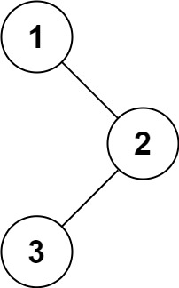
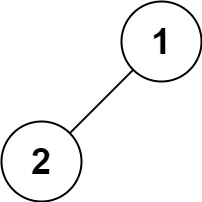
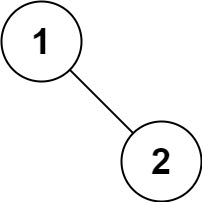

### Binary Tree Inorder Traversal

Given the `root` of a binary tree, return *the inorder traversal of its nodes' values*.

#### Example 1:

<pre>
<strong>Input:</strong> root = [1,null,2,3]
<strong>Output:</strong> [1,3,2]
</pre>
#### Example 2:
<pre>
<strong>Input:</strong> root = []
<strong>Output:</strong> []
</pre>
#### Example 3:
<pre>
<strong>Input:</strong> root = [1]
<strong>Output:</strong> [1]
</pre>
#### Example 4:

<pre>
<strong>Input:</strong> root = [1,2]
<strong>Output:</strong> [2,1]
</pre>
#### Example 5:

<pre>
<strong>Input:</strong> root = [1,null,2]
<strong>Output:</strong> [1,2]
</pre>

#### Constraints:

- The number of nodes in the tree is in the range `[0, 100]`.
- `-100 <= Node.val <= 100`

#### Follow up:

Recursive solution is trivial, could you do it iteratively?