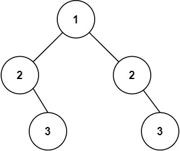

### Symmetric Tree
Given the `root` of a binary tree, *check whether it is a mirror of itself* (i.e., symmetric around its center).

 

#### Example 1:

<pre>
<strong>Input:</strong> root = [1,2,2,3,4,4,3]
<strong>Output:</strong> true
</pre>

#### Example 2:

<pre>
<strong>Input:</strong> root = [1,2,2,null,3,null,3]
<strong>Output:</strong> false
</pre>

 

#### Constraints:

- The number of nodes in the tree is in the range` [1, 1000]`.
- `-100 <= Node.val <= 100`

**Follow up:** Could you solve it both recursively and iteratively?